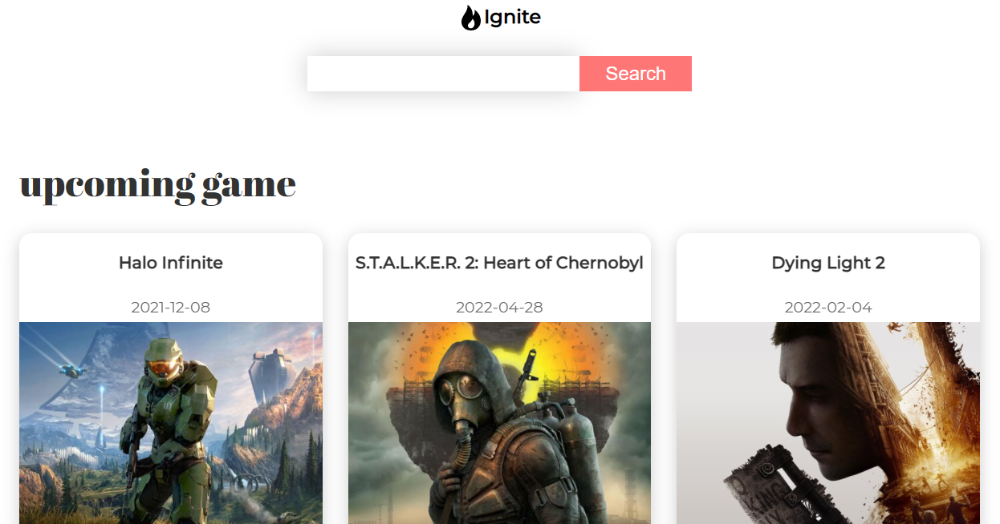

<h1 align="center">ignite</h1>

<div align="center">

Link website: [Click here](https://elated-archimedes-164d04.netlify.app/)

</div>



## note:

click logo if you want delete search.

## :computer: technologies used:

-   HTML
-   Styled-component
-   ReactJs
-   Redux Thunk
-   Framer-motion

## :hammer_and_wrench: set-up

#### 1. Install the dependencies

```
npm install
```

#### 2. Start the development server

```
npm start
```
